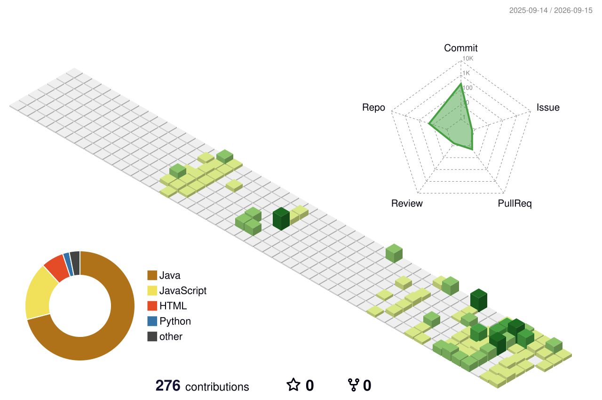

&nbsp;&nbsp;
&nbsp;&nbsp;
&nbsp;&nbsp;
&nbsp;&nbsp;
&nbsp;&nbsp;

 

 

---

### 👋 About Me

Backend-focused Computer Science student (B.Tech, Parul University — CGPA 9.07) skilled in building **scalable, secure web applications** with Java, Spring Boot, REST APIs, and PostgreSQL. Strong foundation in **data structures, algorithms, and OOP**, with hands-on experience across full-stack, production-style projects involving authentication, real-time systems, and relational & NoSQL databases.

🎯 Currently seeking a **Software Engineer** role to build reliable backend systems.

- 🔭 Backend development with **Java & Spring Boot**
- 🌱 Deepening knowledge of **System Design** and distributed systems
- 💬 Ask me about **Spring Security, JWT, REST APIs, WebSockets**
- 📫 Reach me at **amaanaliparchigar0918@gmail.com**
- 🏆 Elite NPTEL Certification — Computer Networks & Internet Protocol (IIT Kharagpur)

---

### 🛠️ Tech Stack

**Languages**

**Backend**

-010101?style=flat-square&logo=socketdotio&logoColor=white)

**Frontend**

**Databases**

**Tools & DevOps**

---

### 🚀 Projects

#### 📚 [Library Management System](https://github.com/Amaanali18/Library_Management_System)
`React.js` `Spring Boot` `Spring Security` `JWT` `PostgreSQL` `REST APIs`

- **Situation:** Libraries need a secure, multi-user system to manage catalogs, borrowing, and returns without manual tracking errors.
- **Task:** Build a full-stack platform with proper authentication and role-based access so members and admins get different permissions.
- **Action:** Implemented JWT-based authentication and role-based access control across frontend and backend; built book catalog, borrowing, return, and inventory modules with Spring Boot and PostgreSQL; designed RESTful APIs and a responsive React.js interface with input validation and centralized exception handling.
- **Result:** A reliable, secure system supporting concurrent multi-user access with clean error handling and a smooth user experience.

#### 🗳️ [Online Voting System](https://github.com/Amaanali18/Voting-App)
`React.js` `Spring Boot` `Spring Security` `JWT` `PostgreSQL` `Logback`

- **Situation:** Digital voting requires strict integrity guarantees — no duplicate votes, verified identity, and traceable actions.
- **Task:** Design a secure online voting platform that authenticates voters and enforces one-vote-per-user rules.
- **Action:** Built authenticated digital voting using Spring Boot, Spring Security, JWT, and PostgreSQL; designed RESTful APIs with role-based authorization and one-vote-per-user validation; implemented a layered architecture with Spring Data JPA and audit logging via Logback.
- **Result:** A voting platform that preserves election integrity, prevents duplicate votes, and improves maintainability and traceability through detailed audit logs.

#### 💬 [Chat Application](https://github.com/Amaanali18/ChatApp)
`React.js` `Spring Boot` `WebSocket` `STOMP` `SockJS` `MongoDB Atlas`

- **Situation:** Real-time communication apps need low-latency, bidirectional messaging with reliable history storage.
- **Task:** Build a scalable real-time chat application supporting multiple chat rooms with persistent history.
- **Action:** Developed real-time messaging using Spring Boot, WebSocket (STOMP), SockJS, and React.js; implemented room-based bidirectional messaging with chat history persisted in MongoDB Atlas; designed a layered architecture for scalable message handling.
- **Result:** Seamless, low-latency real-time communication with durable chat history and an architecture that scales cleanly to more rooms and users.

---

### 📊 GitHub Stats

## My Contributions

  

 

 

 

---

### 🏆 Achievements & Certifications

- 🥇 **Elite NPTEL Certification** — Computer Networks and Internet Protocol (73% score), IIT Kharagpur
- 📜 Certified in **HTML & CSS** (Pearson)
- 📜 Certified in **JavaScript** (Pearson)
- 📜 Certified in **Python** (IBM)

---

### 🎓 Education

**B.Tech, Computer Science and Engineering** — Parul University, Vadodara, Gujarat
`June 2024 – April 2028` | CGPA: **9.07**

---

### 📫 Connect With Me

